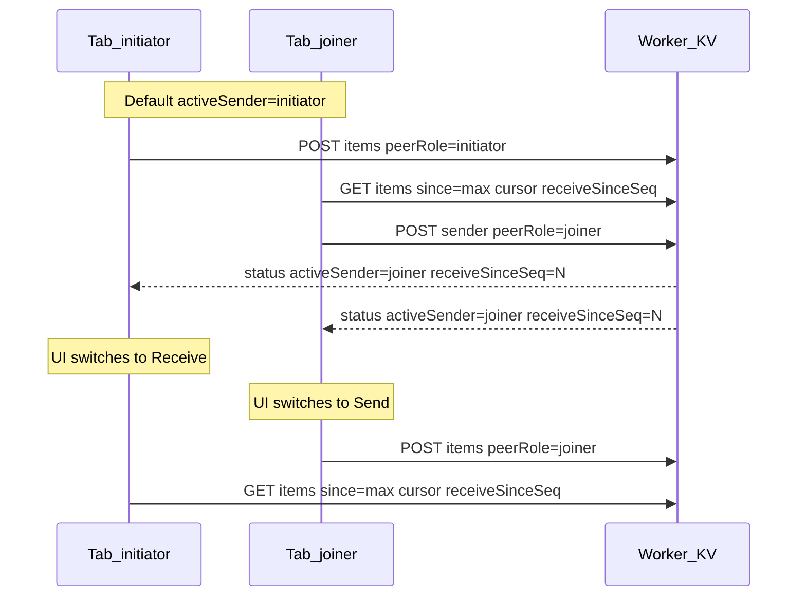
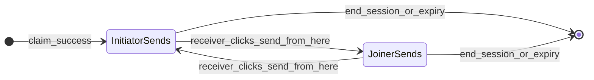

# 13 — Role-based workspace

> **Canonical spec** for the pivot from a shared bidirectional paired workspace to separate send/receive workspaces with a server-synced sender role. Supersedes the "single paired workspace with send + receive together" wording in `10-ui-ux.md` §1.3 and the bidirectional-default note in `05-data-flow.md` §1.

## 1. Migration: shared → separate

### What was built first (#28)

The first implementation paired both routes into the same shared `Workspace` component:

- **`/`** (initiator): start session → waiting → **full workspace** (send + end session)
- **`/connect`** (joiner): enter key → connect → **same full workspace**

Both tabs had textarea, drag-drop, file/folder pickers, and end session. No received list yet (#29). This was a valid interim step to ship send plumbing quickly.

### Why we pivot

| Reason | Detail |
|---|---|
| Personas | Work PC fires off text/files; personal PC receives and uses. Default asymmetric flow matches daily use. |
| Clutter | One screen with send + receive together is noisy when each device has a job. |
| Architecture | `02` diagram already labels work PC sender / personal PC receiver. |
| Receive scope | #29 receive list belongs on the **receiver** workspace only, not both sides. |

### Implementation order

1. **This spec** (and updates to `04`, `05`, `10`, `11`, `12`, `00`)
2. **API:** `activeSender`, `receiveSinceSeq`, `POST /sender`, send `peerRole` enforcement
3. **UI:** split `Workspace` → send mode vs receive mode; receiver-only flip button
4. **#29:** received items list on receive workspace only, filtered by `receiveSinceSeq`

---

## 2. Terminology

| Term | Meaning |
|---|---|
| **peerRole** | Fixed for the tab for the whole session: `initiator` (paired via `/`) or `joiner` (paired via `/connect`). Never changes. |
| **activeSender** | Server field on the pair record: `initiator` \| `joiner`. Who may send right now. Defaults to `initiator` when the session becomes `paired`. |
| **receiveSinceSeq** | Server field: monotonic seq floor for the **current receiver stint**. Bumped on every role flip. Receiver UI shows items with `seq > receiveSinceSeq` only. Defaults to `-1` ("nothing seen yet") so a fresh receiver sees every item from `seq 0`. |
| **Send workspace** | Textarea, whole-window drop target, file/folder pickers. No received list. Only rendered when `peerRole === activeSender`. |
| **Receive workspace** | Received items list (newest first), copy/download, **send from here** flip button. Only rendered when `peerRole !== activeSender`. |

There are no device IDs, accounts, or persistent client identity beyond which route the tab used to pair. `peerRole` is declared by the client on each request (trust-based; acceptable for a personal two-device tool).

---

## 3. Route / UI layout

### `/` — initiator path

| Phase | UI |
|---|---|
| Unpaired | **start session** (existing) |
| Waiting | countdown + status (existing) |
| Paired, `activeSender === initiator` | **Send workspace** |
| Paired, `activeSender === joiner` | **Receive workspace** (items since `receiveSinceSeq`) |

### `/connect` — joiner path

| Phase | UI |
|---|---|
| Unpaired | key input + **connect** (existing) |
| Paired, `activeSender === joiner` | **Send workspace** |
| Paired, `activeSender === initiator` | **Receive workspace** + **send from here** |

### Flip rule

- Only the **current receiver** (`peerRole !== activeSender`) sees **send from here**.
- Clicking it calls `POST /api/{key}/sender` with `{ peerRole }` → sets `activeSender = peerRole`.
- The **active sender** has no flip button. To reverse direction, the other device (now receiver) must click **send from here**.

### Shared chrome (both modes)

- Connection status dot + label (paired / lost / etc.)
- **end session** → `POST /api/{key}/end` → wipe KV+R2 → both tabs reset to unpaired start screens

### Empty states

- **Send:** *paired. nothing sent yet — drop a file, folder, or type text.*
- **Receive:** *waiting for items…*

### Visual

Same calm theme as the current app (`10-ui-ux.md` §5). Single column, desktop-first. Send and receive are **swapped component sections** on the same route — not separate URLs.

---

## 4. Item visibility on flip

- All items remain in the session index until end/expiry. **Nothing is deleted on flip.**
- Items sent before a flip stay in KV/R2 with existing metadata (no new "owner" field). They remain attributed to whoever sent them during that stint.
- On flip, server sets `receiveSinceSeq = maxSeqInIndex` (highest `seq` currently in the item index, or `-1` if empty — `seq` is 0-based, so `-1` is the "show everything" floor).
- Receiver UI displays only items where **`seq > receiveSinceSeq`**.
- Rationale: after a flip, the new receiver only sees **new** traffic for that direction. Prior-stint items are not re-shown, avoiding confusion when roles swap back and forth.
- If the same peer becomes receiver again after a second flip, `receiveSinceSeq` advances again — each receiver stint gets a fresh floor.

---

## 5. API

### PairRecord (KV `pair:{key}`)

```ts
status: "waiting" | "paired"
created: string
lastActive: string
activeSender: "initiator" | "joiner"   // default "initiator" on claim
receiveSinceSeq: number               // default -1 (show everything); bumped on flip
```

Set on successful claim: `activeSender: "initiator"`, `receiveSinceSeq: -1`.

### `GET /api/{key}/status`

Extended response when session exists:

```json
{
  "status": "paired",
  "expiresIn": 599,
  "activeSender": "initiator",
  "receiveSinceSeq": 12
}
```

Omit or use defaults when `unpaired` / `expired`. Both tabs poll this while paired to drive workspace mode switches.

### `POST /api/{key}/sender` (role flip)

**Request:**

```json
{ "peerRole": "initiator" | "joiner" }
```

**Preconditions:**

- Session is `paired`
- Caller is the **current receiver:** `peerRole !== activeSender`

**Effect:**

- `activeSender = peerRole`
- `receiveSinceSeq = maxSeqInIndex`

**Response:**

```json
{ "ok": true, "activeSender": "joiner", "receiveSinceSeq": 12 }
```

**Errors:**

| Code | When |
|---|---|
| `403` / `NOT_ACTIVE_SENDER` | Caller is already the sender (`peerRole === activeSender`) |
| `410` / `SESSION_EXPIRED` | Session missing or expired |

### Send enforcement: `POST /api/{key}/items`

All sends must include `peerRole`:

- **Text (JSON):** `{ type, content, peerRole }`
- **File (multipart):** form field `peerRole` (or `X-Peer-Role` header)

Reject with `403` + `NOT_ACTIVE_SENDER` if `peerRole !== activeSender`.

### Item poll: `GET /api/{key}/items?since=cursor`

Unchanged server behavior. Client in **receive mode** passes:

```
since = max(localCursor, receiveSinceSeq)
```

---

## 6. Client polling model



| Tab mode | Poll status | Poll items |
|---|---|---|
| **Sender** (`peerRole === activeSender`) | Yes (~2s focused, backoff when blurred) | No |
| **Receiver** (`peerRole !== activeSender`) | Yes | Yes (~2s focused, Page Visibility rules from `05` §5) |

On `activeSender` or `receiveSinceSeq` change (detected via status poll):

- Re-render send vs receive workspace
- Receiver resets local item cursor floor to `receiveSinceSeq`

Refresh-resume: `sessionStorage` active session key + status poll restores mode and `receiveSinceSeq` without re-claiming.

---

## 7. State machine (role overlay)



This overlays the existing pairing state machine (`10-ui-ux.md` §1). Terminal transitions (end session, expiry) wipe role fields with the rest of the session.

---

## 8. Edge cases

See also `11-edge-cases.md` §2b.

| Case | Handling |
|---|---|
| Double flip race | KV writes serialize; last flip wins |
| Refresh on receiver | Status poll restores `activeSender` + `receiveSinceSeq`; item poll uses updated floor |
| Sender POST while not activeSender | `403 NOT_ACTIVE_SENDER` |
| Receiver tries flip while already sender | `403` (same code — caller must be receiver) |
| End session | Unchanged — full wipe including role fields |
| Items from prior stint | Remain in index; hidden from new receiver via `receiveSinceSeq` filter |

---

## 9. Out of scope

- Sender-side "receive here" button (flip is receiver-initiated only)
- Filtering by sender identity metadata (seq floor is sufficient)
- Separate URLs for send vs receive (same route, swapped components)
- Prompt Mode layout (`08`) — unaffected
